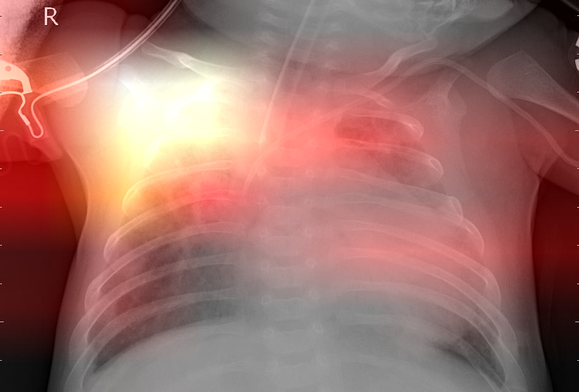
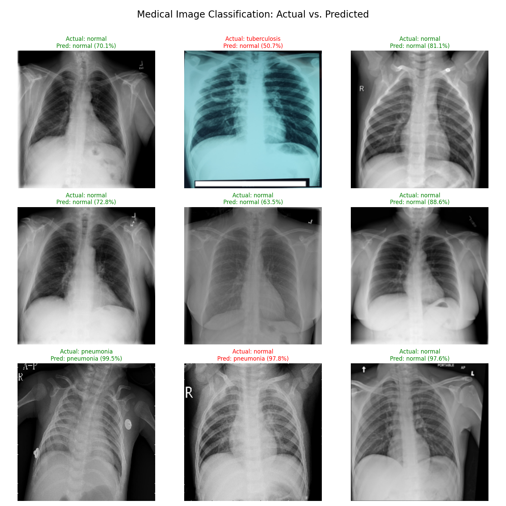

# Multi-Class Medical Image Classification System (Chest X-ray Based)

[](https://usman-ai-dev-healthscan-ai.hf.space)


## Live Demo 🌐
**Test the fully deployed AI diagnostic system here:** 👉 [HealthScan AI Portal](https://usman-ai-dev-healthscan-ai.hf.space)

## Overview
A full-stack, production-ready AI diagnostic system that classifies Chest X-rays into four categories: **COVID-19, Normal, Pneumonia, and Tuberculosis**. Built on a fine-tuned **ResNet50** backbone and served through a professional **Flask web dashboard** with real-time **Grad-CAM visual explainability**.

---

## Project Status: PRODUCTION READY ✅

The system has been developed through four complete stages:

| Stage | Description | Outcome |
|---|---|---|
| Phase 1 | Environment + Baseline ResNet50 | Pipeline established |
| Phase 2 | Initial fine-tuning (20 layers) | 77% peak, overfitting detected |
| Phase 3 | Refinement (10 layers, 0.5 Dropout) | **80.57% stable accuracy** |
| Phase 4 | Full-stack Web Dashboard + Grad-CAM | **Production deployment** |

---

## Key Features

### AI & Model
- **ResNet50 Transfer Learning** — Pre-trained on ImageNet, fine-tuned on medical X-rays
- **Resume-from-Best** — Automatically loads the highest checkpoint before each run
- **Robust Regularization** — 0.5 Dropout and 10-layer fine-tuning to prevent overfitting
- **Adaptive Learning** — `ReduceLROnPlateau` for precision tuning in final epochs
- **Keep-Alive Protection** — Windows sleep prevention wrapper for long training sessions

### Web Dashboard
- **Real-time Inference** — Upload an X-ray and receive diagnosis in seconds
- **Grad-CAM Heatmaps** — Visual "X-Ray Vision" highlighting the exact lung regions the AI analyzes
- **Side-by-Side Comparison** — Raw scan vs. AI attention heatmap shown simultaneously
- **Color-coded Results** — Each disease class has a distinct color-coded result card
- **Medical Disclaimer** — Built-in clinical notice banner on every page
- **Confidence Meter** — Circular ring + animated progress bar showing prediction confidence
- **4-Class Probability Breakdown** — Full score grid for all disease classes

---

## Project Structure

```
├── app.py                  # Flask backend — model serving & Grad-CAM API
├── train.py                # Main training loop with Resume & Refine logic
├── model_builder.py        # ResNet50 architecture definition
├── data_pipeline.py        # Dataset loading, augmentation, preprocessing
├── visualize_results.py    # Batch prediction visualization utility
├── keep_awake_train.py     # Windows sleep-prevention training wrapper
├── smoke_test.py           # Quick sanity check for environment
├── templates/
│   └── index.html          # Premium Light Mode dashboard UI
├── static/
│   ├── style.css           # Full medical-themed stylesheet
│   ├── script.js           # Frontend logic, loading states, micro-interactions
│   └── uploads/            # Temp storage for Grad-CAM heatmap outputs
├── models/
│   └── medical_resnet_v1.h5
├── logs/
│   └── training_log.csv
└── requirements.txt
```

---

## Installation & Setup

**Requirements**: Python 3.12, pip

```bash
python -m venv venv
.\venv\Scripts\Activate
pip install -r requirements.txt
```

---

## Usage

### Run the Web Dashboard
```bash
.\venv\Scripts\python app.py
```
Then open your browser at: **`http://127.0.0.1:5000`**

### Train the Model
```bash
.\venv\Scripts\python keep_awake_train.py
```

### Visualize Batch Predictions
```bash
.\venv\Scripts\python visualize_results.py
```

---

## Visualization Results

### Diagnostic Dashboard
The web dashboard provides a real-time side-by-side view of the original X-ray and the AI's Grad-CAM attention heatmap.



### Batch Prediction Sample
Sample of the model's batch performance on the validation set.



---

## Results Summary

| Metric | Value |
|---|---|
| **Validation Accuracy** | **80.57%** |
| **Validation Loss** | 0.47 (Stable) |
| **AUC Score** | >0.95 across all classes |
| **Classes** | COVID-19, Normal, Pneumonia, Tuberculosis |
| **Explainability** | Grad-CAM (conv5_block3_out layer) |

---

## Medical Disclaimer

> This system is designed exclusively to **assist qualified medical professionals**. It does **not** replace clinical diagnosis. Always consult a licensed physician before making any medical decisions.

---

## License
Distributed under the MIT License. See `LICENSE` for more information.
